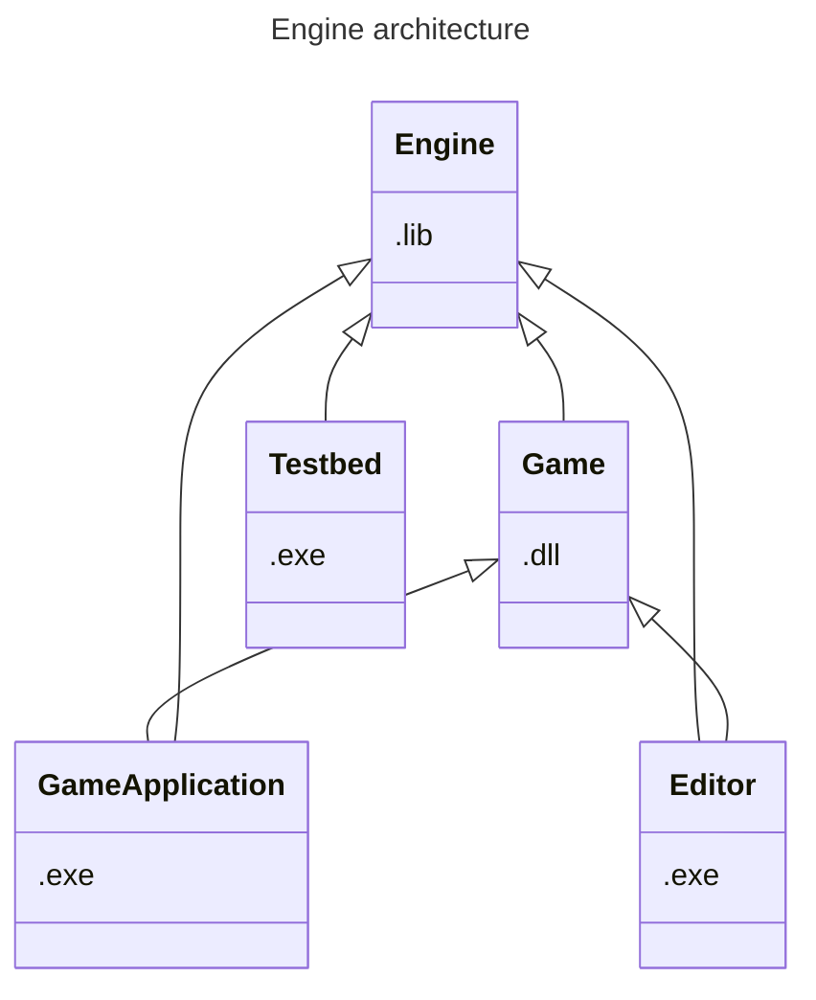

#week_1 
#planning 
#engine

# Architecture design



There will be a couple of projects while creating the game engine.
The engine: A library that will needed things for every game or application made with it.
The Game: a dynamically linked library that will be loaded by an application program that runs the game.
The Editor: will load the game dll and will be loaded by the application executable.
A Testbed: here all the features of the game engine library will be tested and displayed.

The game engine will be compiled to a static lib. The game engine will include a lot of basic things for example: creating windows, setting up the renderer, setting up and updating physics, etc.. The game engine will be build with an entity component system. There will be a couple of basic components that the engine uses e.g. transform component, render component, child parent component and more.

# Libraries

- Vulkan - Rendering using the GPU
- PhysX - physics engine
- win32 - creating windows and handling input
- ImGui - editor UI
- entt - entity component system

- Noesis gui? - could be used as a ui system for the game
- Json? - could be used for serializing and deserializing data
- FMod? - could be used as the audio engine
# Features
## Models
#models
I will be using gltf to load models into the editor and I will then write a raw data binary file of the expected format the models have to be in. I could take a look at assimp to load other types of models but I have a good experience with gltf. I have to figure how I am going to be saving the animations in raw binary. so the idea is to load the models in one program and save them in a file format that I expect so I can instantly upload them in the game.

<mark>TODO: Design the animation system</mark> 

## ECS
#ecs
I will be using entt as an entity component system. The engine will have a couple of basic components that can be used in every game. The game itself will have the ability to create some components and systems. the systems will be updated once the update loop of the engine has been completed.

## Serialization and deserialization
#serialization
I will have to look into what file format I am going to be using for this, it might be json or yaml. I have used yaml before but I prefer jsons format. I will save and load entity data. The components will be able to specify what data of it should be saved and loaded. I should look into creating or using a reflection system for this.

## Audio
#audio
I have not worked with any form of audio in c++ before. I will need to research what file formats to use and what library to use for audio. I have read that FMod is promising. 

# Build system
#build_system
#cmake
the folder structure will look something like this
```objectivec
my_game_engine/
├── CMakeLists.txt
├── engine/
│   ├── CMakeLists.txt
│   ├── include/
│   └── src/
├── game_executable/
│   ├── CMakeLists.txt
│   ├── include/
│   └── src/
├── game_code/
│   ├── CMakeLists.txt
│   ├── include/
│   └── src/
├── editor/
│   ├── CMakeLists.txt
│   ├── include/
│   └── src/
├── testbed/
│   ├── CMakeLists.txt
│   ├── include/
│   └── src/
├── third_party/
│   └── (External dependencies)
├── CMake/
│   └── (CMake scripts, modules, etc.)
└── build/
    └── (Build output files)
```

For building I will use cmake

When building I will first create the project files and then build the entire project. This will later be split up in building the separate projects. For instance build the engine is different from building the test bed and editor.

each project will have a src and include directory. In the src directory will be all the .cpp files that need to be build for that project as well as .h files that should not be public for other projects what comes to mind for example is the rendering code. I will have a renderer.h file that exposes all the high level render features of the engine. I will also have a vulkan_renderer.h file that will have vulkan specific code in it that I do not want to expose to the game project.

# Game code

the game code will be written as a separate dll project. this will be loaded by the game executable or the editor. the reason for this decision is because I want the editor to be aware of the game code while not being dependent on it and I want the game code to be hot swappable this means that I can run the program, change some game logic and reload it while the game is running.

## Hot swapping
My idea is to have a module structure. when the executable loads the dll some starter functions get called and the game is able to subscribe to events. When these events fire the game will be updated.

This is an example for the game dll code.
```C++

void GameModuleAwake() {
	// subscribe to all the events.
}

void GameModuleShutdown() {
	// shutdown all the logic.
}

```


When the dll gets loaded for the first time it call the ```GameModuleAwake()```. When the module gets shut down ```GameModuleShudown()``` is called. when hot reloading it first needs to clear the scenes that are currently loaded. but before it does that it needs to serialize all the data to disk so it can load it up again. 

Example of a component made on the game side:
```c++

#define AddComponent(componentName) // component add logic here
#define AddComponentVar(componentName, variableName, shouldSerialize) \ 
	// component variable add logic here

struct PlayerComponent {
	vec3 MovementSpeed;
	vec3 LookSensitivity;
}

void GameModuleAwake() {
	AddComponent(PlayerComponent);
	AddComponentVar(PlayerComponent, MovementSpeed, true);
	AddComponentVar(PlayerComponent, LookSensitivity, true);	

}

```

With in the game engine there will be a component registry this registry will keep track of all the components. it will keep track of the size of the components and variables of the components. using this it will be easy to serialize and detribalize the components without knowing the details of it. This way the entity component system also doesn't need to know anything specific about the components. it just needs to know the size of them so it can allocate memory for it. It will now also have a reference to the components name so it can store them and find them.